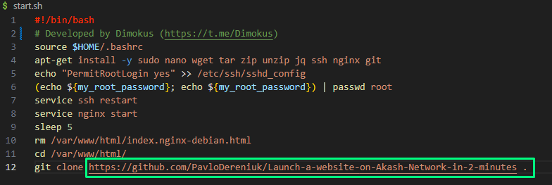
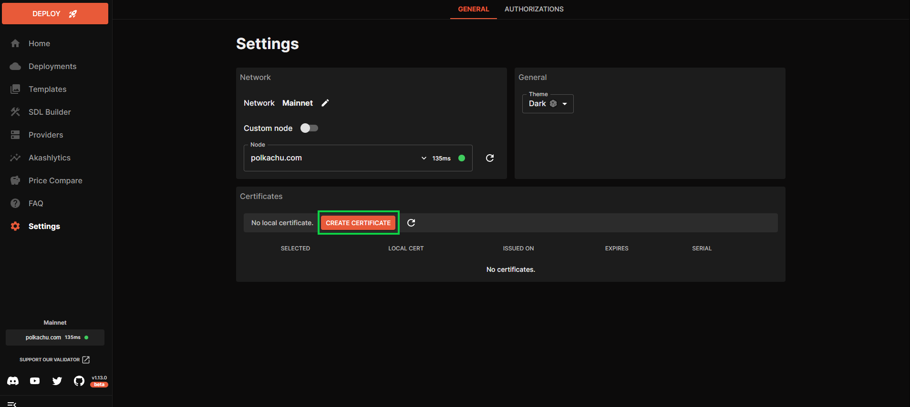
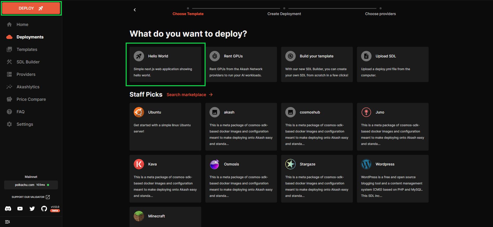
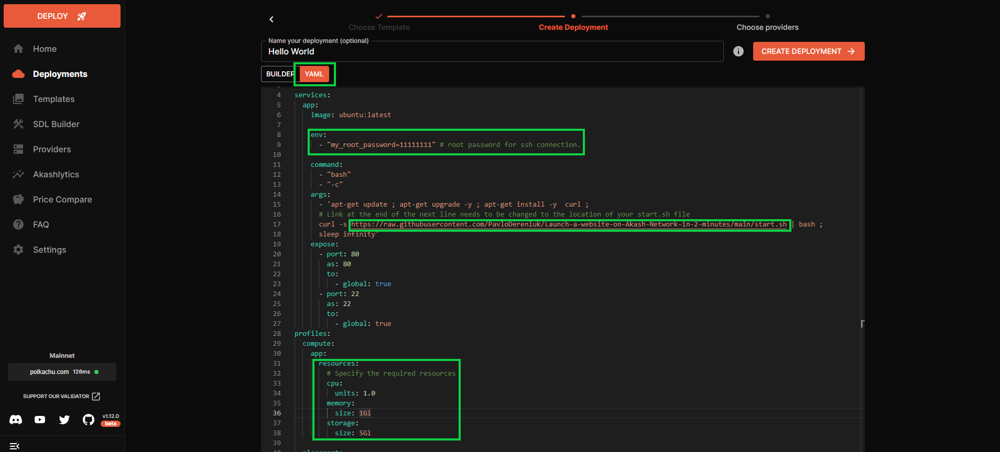
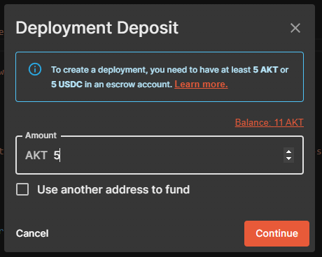
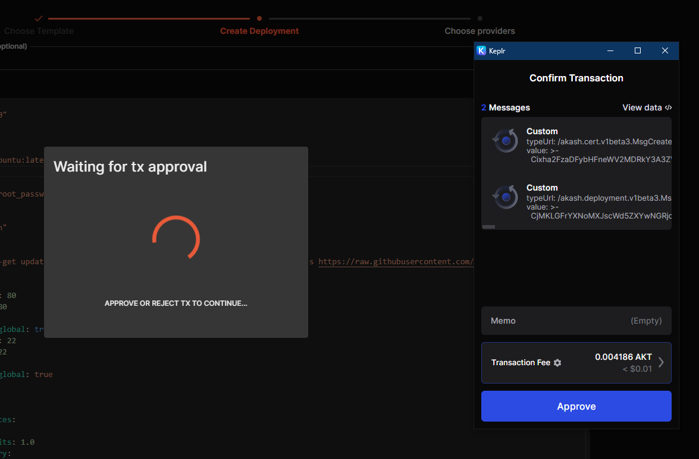
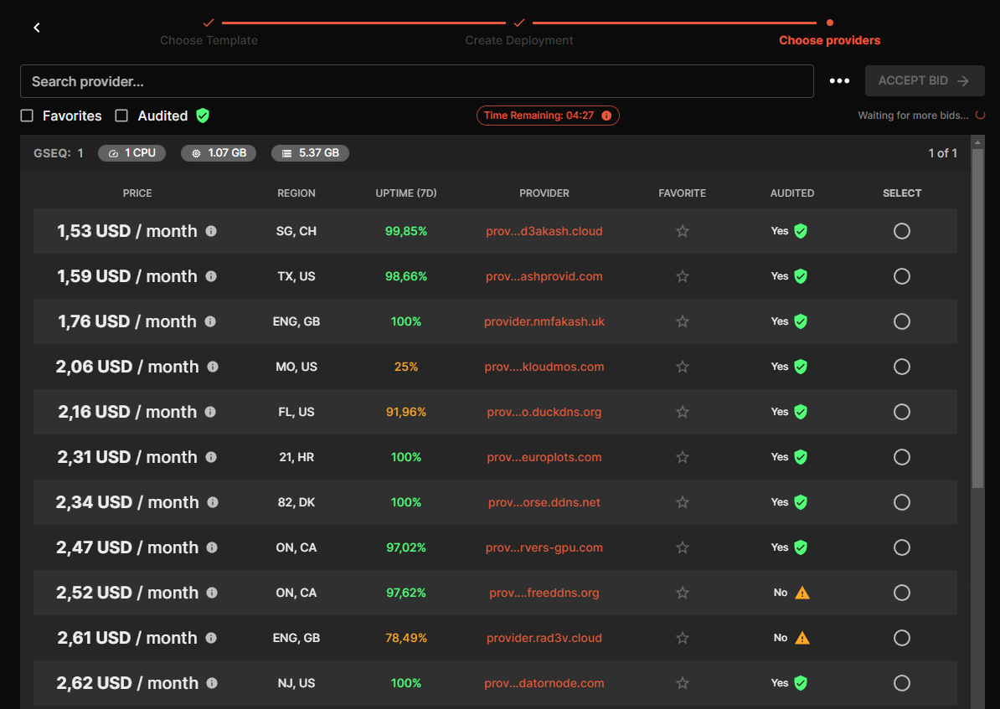
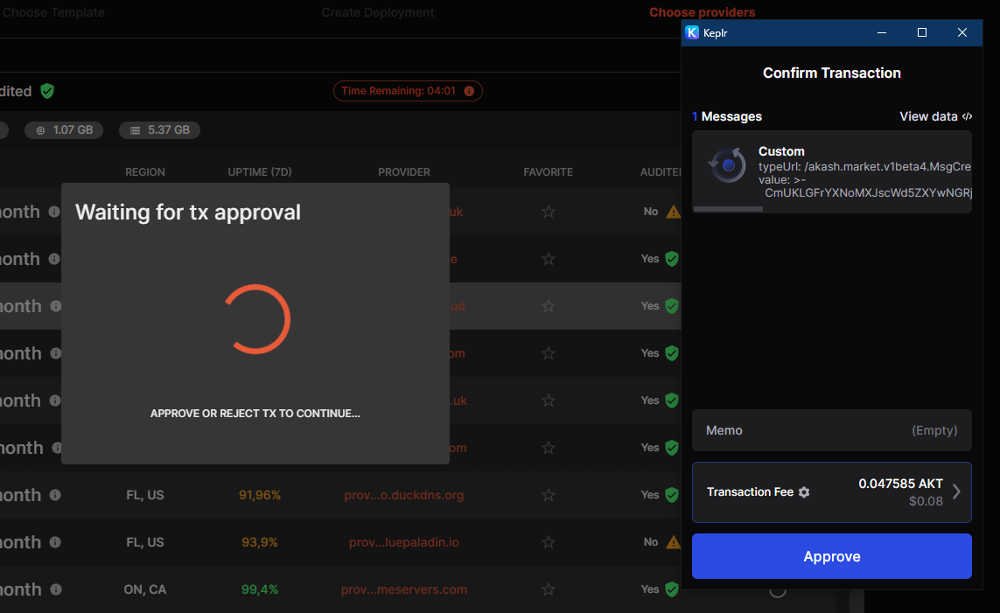
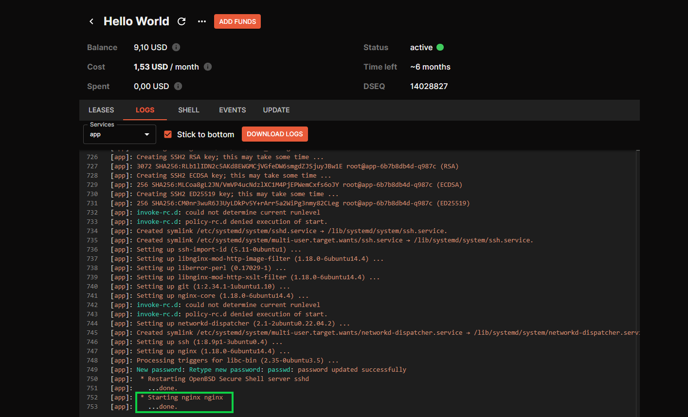
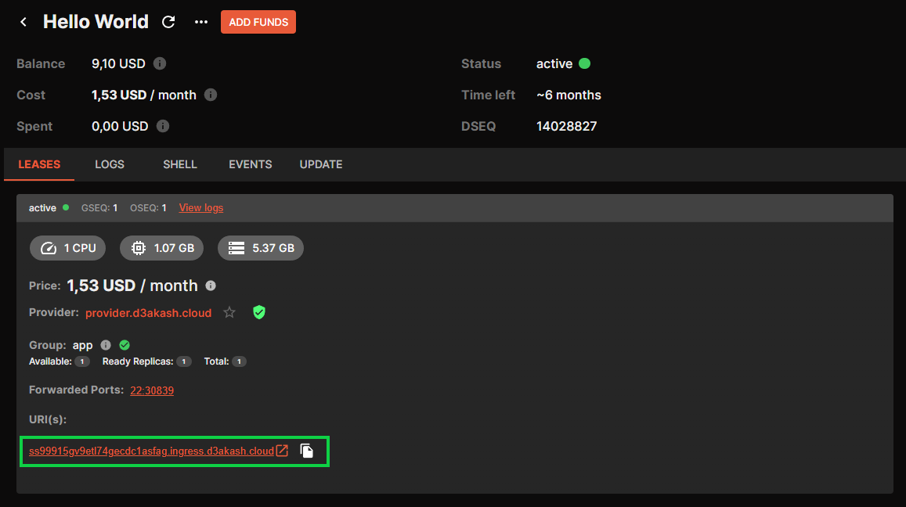

# Launch a website on Akash Network in 2 minutes

 To deploy a website on Akash, you need to have your website code hosted on GitHub, an installed Keplr wallet, and the Cloudmos platform.

 This instruction is suitable for landing pages that use only HTML, CSS, and JS.
## So, let's get started:

1. The first step is to transfer your website's code to the GitHub repository. Additionally, add a file named start.sh with the startup settings to the same repository. (If necessary, the name of the settings file can be replaced, but in this case, don't forget to update it in the [yml](./deploy.yml) file itself). You can find the  start.sh file [here](./start.sh). In the start.sh file, make sure to change the name of the repository where your site is hosted.

<p></p>

2. You will also need to install the [Keplr](https://chromewebstore.google.com/detail/keplr/dmkamcknogkgcdfhhbddcghachkejeap?hl=uk&utm_source=ext_sidebar) wallet extension for your browser. Instructions for the installation can be found [here](https://help.keplr.app/articles/installation-guide-for-keplr-extension-for-beginners).
<p></p>

3. Next, visit the [Cloudmos](https://deploy.cloudmos.io/) website. To deploy your site, you'll need a minimum of 5 AKT in your account. Instructions on how to fund your account can be found [here](https://docs.akash.network/tokens-and-wallets/buy). Also, when logging into Cloudmos for the first time, create a certificate in the Settings section. Click the 'Create Certificate' button, confirm all transactions, and the certificate will be ready in a few seconds. 

<p></p>

4. Create a new deployment, select 'Hello World,' and in the YAML tab, replace everything with the content from this [file](./deploy.yml)

<p></p>

5. In this file, you should update the following fields:
   - my_root_password: password for SSH login
   - Link to the startup settings file (start.sh)
   - Required resources for deployment

<p></p>

6. After making these changes, you need to confirm the initial deposit to launch the deployment, which is 5 AKT.

<p></p>

7. Click on all the necessary confirmations

<p></p>

8. After a while, you'll see a list of providers. Choose the one that best fits your needs, select the corresponding checkbox, and click 'ACCEPT BID.'

<p></p>

9. Then you approve it all again

<p></p>

10. After that, switch to the LOGS tab and wait for the following text to appear
```
* Starting nginx nginx
...done.
```

<p></p>

11. After that, you go to the LEASES tab where a link to your site will appear


<p></p>

## Congratulations, your website has been successfully deployed on Akash Network!

### Some lifehacks:

 - If you want to have a readable domain instead of one with many incomprehensible characters, you can do this by commenting out (erasing '#' at the beginning of these lines) two lines in the [yml](./deploy.yml) file (accept: "sitename.providername"). Also, for this to work correctly, you need to choose the provider where you will deploy the site in advance. The domain name consists of two parts: the first part is the name of your site, and the second part is the name of the provider where you will deploy the site. Here is an example of how it might look:
 ``` code
     accept:
    - "akashsite.ingress.europlots.com"  
```
<p></p>

- If you are trying to deploy a site, but the site does not deploy, or you get any errors, first try closing the deployment and launching it on another provider. If this doesn't help, carefully check your start.sh and yml files to make sure that all the links are correct. Also, you can always write to the official Akash Network discord and ping the user @kapitoshko.
<p></p>

- Also, using a SHH connection, you can log in to the Ubuntu that this site is deployed with and change or add additional files. You can also completely replace the site by mounting a different repository.